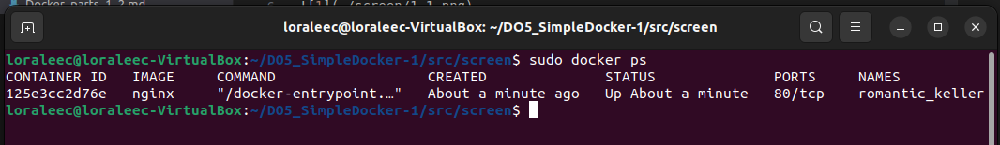
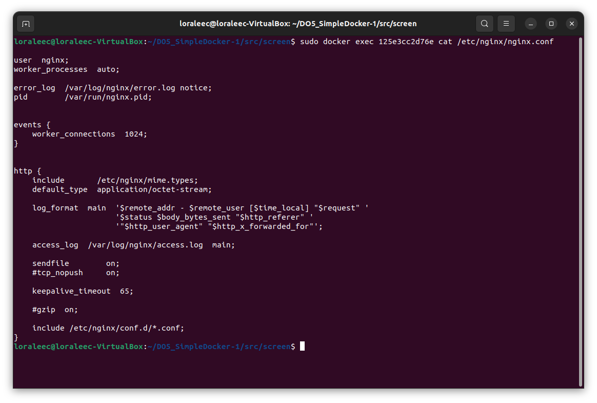
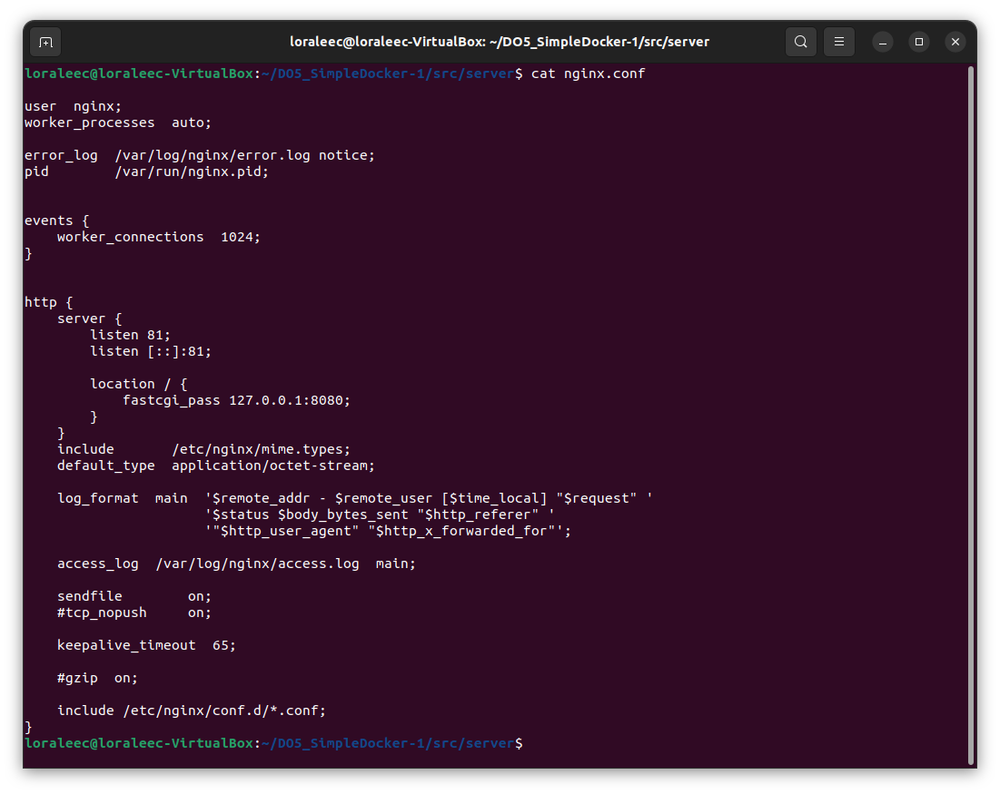

## Part 1. Готовый докер

1. **Взять официальный докер образ с nginx и выкачать его при помощи** `docker pull`  

2. **Проверить наличие докер образа через** `docker images`  

  

3. **Запустить докер образ через** `docker run -d`  

  

4. **Проверить, что образ запустился через** `docker ps`  

  

5. **Посмотреть информацию о контейнере через** `docker inspect [container id]`  

  

6. **По выводу команды определить и поместить в отчёт размер контейнера, список замапленных портов и ip контейнера**  

  
*Размер контейнера*   

  
*Список замапленных портов контейнера*   

>Замапленный порт - порт с настроенной переадресацией на какой-то другой порт  

  
*ip контейнера*  

7. **Остановить докер образ через** `docker stop`  

  

8. **Проверить, что образ остановился через** `docker ps`  

  

9. **Запустить докер с портами 80 и 443 в контейнере, замапленными на такие же порты на локальной машине, через команду** `run`  

  

10. **Проверить, что в браузере по адресу *localhost:80* доступна стартовая страница nginx**  

  

11. **Перезапустить докер контейнер через** `docker restart`  
**Проверить любым способом, что контейнер запустился**  

  

## Part 2. Операции с контейнером

1. **Прочитать конфигурационный файл *nginx.conf* внутри докер контейнера через команду** `exec`  

  

2. **Создать на локальной машине файл *nginx.conf***  
**Настроить в нем по пути */status* отдачу страницы статуса сервера nginx**  

  

3. **Скопировать созданный файл *nginx.conf* внутрь докер образа через команду** `docker cp`  
**Перезапустить nginx внутри докер образа через команду** `exec`  

  

4. **Проверить, что по адресу *localhost:80/status* отдается страничка со статусом сервера nginx**  

  

5. **Экспортировать контейнер в файл *container.tar* через команду** `export`  
**Остановить контейнер**  

  

6. **Удалить образ через** `docker rmi [image_id|repository]`**, не удаляя перед этим контейнеры**  
**Удалить остановленный контейнер**  

 

7. **Импортировать контейнер обратно через команду** `import`
**Запустить импортированный контейнер**  

 

8. **Проверить, что по адресу *localhost:80/status* отдается страничка со статусом сервера nginx**

  

## Part 3. Мини веб-сервер  

### Предварительно стоит отметить, что отчет по этой и следующим частям носит исключительно демонстрационный характер, все используемые и продемонстрированные составляющие частей проекта находятся в репозитории и доступны для тестов.  

1. **Написать мини сервер на C и FastCgi, который будет возвращать простейшую страничку с надписью Hello World!**

  

2. **Написать свой *nginx.conf*, который будет проксировать все запросы с 81 порта на 127.0.0.1:8080**  

  

===

**Далее необходимо запустить контейнер, на котором будет произоводиться работа и скопировать туда файлы**  

  

**Затем в контейнер установим необходимые утилиты**  

  
  
  

**И последний шаг в данном разделе: запустить написанный мини сервер через** `spawn-fcgi` **на порту 8080 и перезапустить nginx**

  

3. **Проверить, что в браузере по *localhost:81* отдается написанная вами страничка**  

  

4. **Положить файл *nginx.conf* по пути *./nginx/nginx.conf***  

  

## Part 4. Свой докер

### **Написать свой докер образ, который:**

- **собирает исходники мини сервера на FastCgi из *Части 3***

- **запускает его на 8080 порту**

- **копирует внутрь образа написанный *./nginx/nginx.conf***

- **запускает nginx.**

*nginx можно установить внутрь докера самостоятельно, а можно воспользоваться готовым образом с nginx'ом, как базовым.*

  
*Dockerfile*  

  
*start.sh*

1. **Собрать написанный докер образ через docker build при этом указав имя и тег**
**Проверить через** `docker images`, **что все собралось корректно**

  

3. **Запустить собранный докер образ с маппингом 81 порта на 80 на локальной машине и маппингом папки *./nginx* внутрь контейнера по адресу, где лежат конфигурационные файлы nginx'а**

  

4. **Проверить, что по *localhost:80* доступна страничка написанного мини сервера**

  

5. **Дописать в *./nginx/nginx.conf* проксирование странички */status*, по которой надо отдавать статус сервера nginx**
**Перезапустить докер образ**

  

*Если всё сделано верно, то, после сохранения файла и перезапуска контейнера, конфигурационный файл внутри докер образа должен обновиться самостоятельно без лишних действий*  

7. **Проверить, что теперь по localhost:80/status отдается страничка со статусом nginx**

  

## Part 5. Dockle  

1. **Просканировать образ из предыдущего задания через** `dockle [image_id|repository]`  

  

2. **Исправить образ так, чтобы при проверке через** `dockle` **не было ошибок и предупреждений**  

  

**Варианта устранения ошибки CIS-DI-0010 было два: установка NGINX сверху какого-либо дистрибутива, или флаг -ak, я выбрал второй.**  

## Part 6. Базовый Docker Compose  

**Написать файл *docker-compose.yml*, с помощью которого:**

1) **Поднять докер контейнер из Части 5 (он должен работать в локальной сети, т.е. не нужно использовать инструкцию EXPOSE и мапить порты на локальную машину)**

2) **Поднять докер контейнер с nginx, который будет проксировать все запросы с 8080 порта на 81 порт первого контейнера**

  
Успешно собранный и запущенный проект  

 
